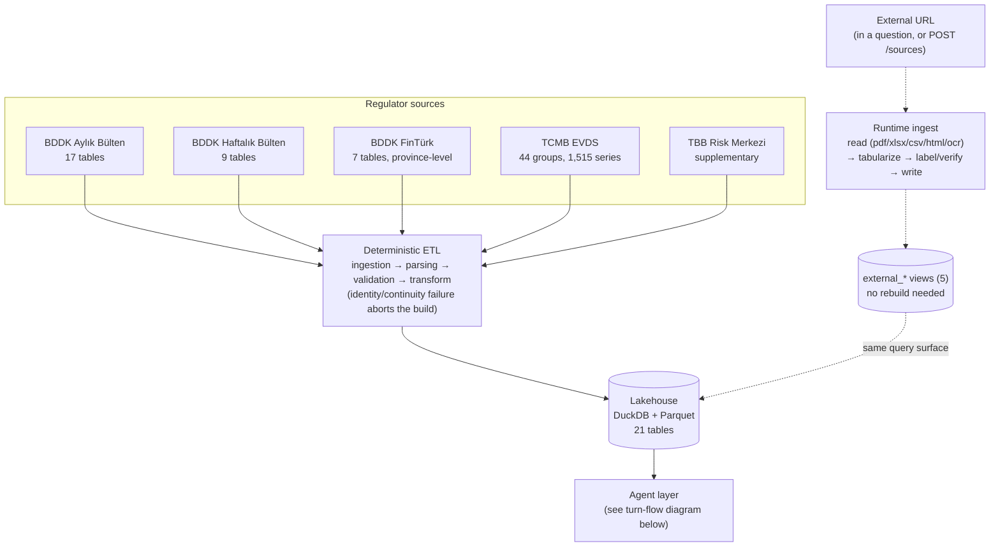
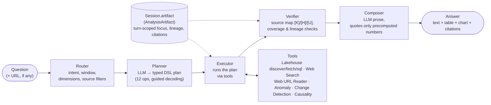

# KKB Agentic Data Analytics

A deterministic data pipeline that turns Turkish banking-regulator publications into a queryable DuckDB
lakehouse, built so an LLM agent never has to do arithmetic or schema reasoning itself.

Submission for the **KKB Hackathon 2026 — Lakehouse Agent Builder and Data Analytics**.

Current state: the ingestion, validation and lakehouse layers are implemented and tested, and the
agent layer runs end to end against the Kloudeks/MIA open-weight endpoint — a typed plan DSL, the
brief's tools, a verifier and a cited answer — behind a FastAPI service with a React frontend
(`backend/api/`, `frontend/`). Demo-day URLs (Excel, CSV, PDF, images, pages linking to them) are landed in the lakehouse automatically. `docker compose up --build` runs the whole system with nothing installed on the host but Docker — see [Docker](#docker-no-venv-no-npm-install-no-playwright-install-on-the-host) below.

An optional [SearXNG + Crawl4AI web-tools extension](extensions/web_tools/README.md) provides
`search_web`, HTML `read_url`, and automatic `read_web_url` callables, with separately optional
[file, image, OCR, and Kloudeks vision tools](extensions/web_tools/ASSETS.md). Each capability
has switches and resource limits. Dependencies run in separate containers; all tools are
disabled by default (`WEB_TOOLS_ENABLED`) and do not change the pipeline setup below. When enabled,
the API wires the extension's `search_web` in as the agent's web-search backend; the in-process
`backend/tools/web_url.py` remains the URL reader either way.

**JS-rendered pages.** A page whose numbers are filled in by client-side JavaScript after load (an index
page like `borsaistanbul.com/endeks/xtumy`) publishes none of them in the HTML `read_url`'s plain HTTP
fetch receives — the fields are there, just empty. `backend/tools/browser_render.py` renders the page in
headless Chromium (Playwright) and hands the settled HTML back to the same extractor; `read_url` falls
back to the plain fetch on its own if no browser is installed, so this degrades rather than breaking.
**The browser binary is a separate, per-machine download that `pip install` does not do for you** —
`playwright install chromium` once, after the pip install below, or this path silently falls back to the
un-rendered page with no error.

To try the web tools yourself, use the [Docker-to-results testing walkthrough](extensions/web_tools/TESTING.md).
For developer onboarding without changing the baseline environment, start with
the [developer guide](extensions/web_tools/DEVELOPER_GUIDE.md).
For AI integration, see the [tool contracts and usage reference](extensions/web_tools/AI_USAGE.md).
For the complete search-to-answer demo, see [DEMO.md](extensions/web_tools/DEMO.md).
For several sources, explicit coverage and conflict reporting, see the
[multi-source research guide](extensions/web_tools/MULTISOURCE.md).

---

## Quick start

**Docker is the recommended way to run this** — one command, nothing to install but Docker itself,
no Python/Node version issues to hit. Put your key in a repo-root `.env` file (gitignored; Compose
reads it automatically):

```
KLOUDEKS_API_KEY=your-key-here
```

then:

```bash
docker compose up --build
```

**First build takes about 400 seconds** (~7 minutes) — it installs every Python dependency,
downloads a full headless Chromium browser for JS-rendered pages, copies in the committed regulator
archives and builds the entire lakehouse (135k+ observations across BDDK/EVDS/TBB) into the image, so
the container starts instantly on every run after that. Subsequent `docker compose up --build` calls
only rebuild the layers that actually changed (usually seconds). Once both containers report
healthy, open `http://localhost:5173`. Web search and the multi-step "Web araştırması" mode are off
in this plain form; see the [Docker](#docker-no-venv-no-npm-install-no-playwright-install-on-the-host)
section below for the one-command version with both turned on.

### Without Docker (native: Python + Node on the host)

Requires **Python 3.10 or newer**. Nothing else for the pipeline itself — no network access, no
database server. (`playwright install chromium` below is the one step that does need network: it
downloads the browser binary, not a Python package.)

**Check your Python version first** — this is the step that silently breaks the rest. macOS ships
`python3` only (no bare `python`), and it is frequently an old system copy (3.9 or earlier) whose
bundled `pip` is too old to install this project at all: it fails on `pip install -e` with
`Directory cannot be installed in editable mode` / `"setup.py" or "setup.cfg" not found`, an error
that names the wrong cause. Confirm 3.10+ before anything else:

```bash
python3 --version   # macOS/Linux -- must read 3.10 or higher
py --version         # Windows (the `py` launcher) -- must read 3.10 or higher
```

If it reads lower than 3.10, install a newer one first (macOS: `brew install python@3.12`; Windows:
python.org installer, checking "Add python.exe to PATH") and use that interpreter explicitly below
(e.g. `python3.12`, or `py -3.12`) instead of the bare `python3`/`py`.

**macOS / Linux** (bash/zsh):

```bash
git clone <repo-url>
cd Agentic_Analysis_Coderspace

python3 -m venv .venv
source .venv/bin/activate
pip install --upgrade pip                                # old venvs inherit an old pip; see above
pip install -e ".[dev,ingest]"

python -m backend.ingestion.bddk_bulletin --from-cache    # raw workbooks from the archived responses
python -m backend.lakehouse.build                         # parse -> validate -> parquet + duckdb
pytest -q                                                 # ~945 tests (34 skip without the web-tools containers, KKB_LIVE_TESTS or the OCR recording;
                                                           # 3 fail without Docker running -- extensions/web_tools' own CLI/gateway tests, unrelated to the pipeline)

playwright install chromium                               # one-time, per machine -- see "JS-rendered pages" below
```

**Windows** (PowerShell):

```powershell
git clone <repo-url>
cd Agentic_Analysis_Coderspace

py -m venv .venv
.venv\Scripts\Activate.ps1
# If this is refused with "running scripts is disabled on this system", run once per user:
#   Set-ExecutionPolicy -Scope CurrentUser -ExecutionPolicy RemoteSigned
pip install --upgrade pip
pip install -e ".[dev,ingest]"

python -m backend.ingestion.bddk_bulletin --from-cache
python -m backend.lakehouse.build
pytest -q                                                 # same ~945 tests; up to 9 of the web-tools extension's Docker/process-group tests fail on Windows specifically, unrelated to the pipeline itself

playwright install chromium
```

Every command after venv activation is the same Python module invocation on both platforms (no
shell-specific syntax) — only cloning, activating and chaining commands differ. Avoid `&&` to chain
these lines verbatim into one: it silently doesn't run the second command on Windows PowerShell
versions before 7 (very common on a stock Windows install), so each line above stands on its own.
Using `cmd.exe` instead of PowerShell, activate with `.venv\Scripts\activate.bat` and `&&` chaining
works there.

That produces `data/lakehouse.duckdb` and `data/analytics/schema_card.md`. The whole thing runs offline
because the regulator responses are committed to the repository — see [Raw data](#raw-data).

Query it:

```bash
python -c "import duckdb; print(duckdb.connect('data/lakehouse.duckdb', read_only=True).execute('''
    SELECT period, value FROM bulletin_observations
    WHERE entity_key = 'tuketici_kredileri_konut' AND currency = 'total'
    ORDER BY period DESC LIMIT 6''').df())"
```

---

## Running the app (native, without Docker)

If you used Docker above, the app is already running — skip to [Docker](#docker-no-venv-no-npm-install-no-playwright-install-on-the-host)
below for stopping it and turning web search on. This section is for the native path: "Without
Docker" above builds the data lakehouse and runs the tests; it does not start the live system. This
does — two processes, backend then frontend, each in its own terminal (with `.venv` already
activated per "Without Docker" above).

**1. Set the model key**, so the agent can plan and write prose instead of falling back to
deterministic-only mode. Put it in a gitignored `.env` file at the repo root (create it if it
doesn't exist):

```
KLOUDEKS_API_KEY=your-key-here
```

or export it in the shell instead (`export KLOUDEKS_API_KEY=...` on macOS/Linux,
`$env:KLOUDEKS_API_KEY="..."` in PowerShell). Without it the API still starts and answers with
SQL-computed numbers and template prose — no crash, just no model-written text or planning.

**2. Start the backend** (from the repo root, needs the completed lakehouse build from Quick start):

```bash
uvicorn backend.api.main:app --port 8000
```

Confirm it's up: `curl http://127.0.0.1:8000/health` should return `{"status":"ok", ...}`.

**3. Start the frontend**, in a second terminal:

```bash
cd frontend
npm install       # once
npm run dev
```

Vite prints the URL it's serving on (typically `http://localhost:5173`); open that in a browser.
The dev server proxies `/ask`, `/health`, `/session` and `/debug` to the backend on port 8000, so
both must be running for the UI to work.

**"Soru modu" (question mode)**, top of the chat panel, picks which pipeline answers the question:

| Mode | What it does |
|---|---|
| **Otomatik / veri analizi** (default) | The lakehouse agent: discovers series, fetches, transforms, analyzes, answers with cited numbers. Same pipeline the whole rest of this README describes. |
| **Web araştırması** | The bounded multi-step research loop (search → read → cite) instead — for a question about something the lakehouse doesn't hold. Grayed out and labeled "(kapalı)" unless the backend reports `research_configured: true` (needs both `WEB_TOOLS_ENABLED` and `WEB_AGENT_ENABLED` — see [Docker](#docker-no-venv-no-npm-install-no-playwright-install-on-the-host) or the native web-search section above). |

A table only appears when the question's own words ask to see one ("tablo", "veri seti", "sütun",
"listele"), and a chart only when it asks to see one ("grafik", "çiz", "görselleştir") — this is
deliberate (`router.wants_a_table`/`CHART_PATTERN`), not a bug: a plain question gets prose, and
the empty Tablo/Grafik tabs say which words to add.

Both commands are identical on Windows and macOS/Linux once the venv (backend) and Node.js
(frontend) are set up — Node.js itself is not part of this pipeline's Python setup and needs its
own install from [nodejs.org](https://nodejs.org) if `npm` is not already on your machine.

**Web search and research mode, without Docker.** Off by default here too, same reason as the
Docker path below: it's a separate stack (SearXNG + a sandboxed crawler/egress pair) most setups
won't have running.

```bash
python extensions/web_tools/web-tools setup    # once: generates a private secret + config
python extensions/web_tools/web-tools start     # starts SearXNG + crawler/egress, in their own containers

WEB_TOOLS_ENABLED=true WEB_AGENT_ENABLED=true uvicorn backend.api.main:app --port 8000
```

`web-tools start` still uses Docker for that one stack (SearXNG and the crawler are containers
either way — see [`extensions/web_tools/`](extensions/web_tools/README.md)); only this backend and
the frontend run natively here. Single-shot search ("... internetten araştır") works with
`WEB_TOOLS_ENABLED=true` alone; the multi-step "Web araştırması" mode also needs
`WEB_AGENT_ENABLED=true` on this command **and** on the web-tools stack itself
(`extensions/web_tools/.env`: `WEB_AGENT_ENABLED=true`, `WEB_KLOUDEKS_API_KEY=<your key>`) — two
separate flags of the same name in two separate places, because the model calls for that mode run
inside the crawler container, not this backend.

### Docker (no venv, no `npm install`, no `playwright install` on the host)

The same two services (backend + frontend), already covered at the top of Quick start —
`docker compose up --build`, ~400s the first time, seconds after that. This section is the rest of
it: stopping, and turning web search on.

`docker compose down` stops both containers; `docker compose up --build` again after a code change
rebuilds only the layers that actually changed.

**Web search is optional and lives outside this compose file**, in a separate stack (SearXNG +
crawler/egress, see [`extensions/web_tools/`](extensions/web_tools/README.md)) that most setups
won't have running. Plain `docker compose up --build` above leaves it off
(`WEB_TOOLS_ENABLED=false`), and a search question fails that one step instead of blocking startup.
There are two ways to turn it on, depending on which of the two search modes you need:

**1. Single-shot web search** (a question that just needs "look this up") — start the web-tools
stack once with its own official launcher, then point this app at it:

```bash
python extensions/web_tools/web-tools setup    # once: generates a private secret + config
python extensions/web_tools/web-tools start     # starts SearXNG + crawler/egress

WEB_TOOLS_ENABLED=true docker compose up --build
```

`host.docker.internal` (wired into `docker-compose.yml` already) is what lets the backend container
reach those containers on the host — plain `127.0.0.1` from inside a container means that container,
never the host machine, which is why a naive Docker setup for this piece silently fails. Use the
launcher (`web-tools start`), not a manual `docker compose up` inside `extensions/web_tools/`: it
picks the right image automatically for whatever `extensions/web_tools/.env` asks for (see below).

**2. Multi-step "Web araştırması" / research mode** (the model searches, reads and cites on its
own, bounded by call/byte/time limits) — one file, one command, everything included:

```bash
python extensions/web_tools/web-tools setup    # once, if not already done -- generates a private secret
docker compose -f docker-compose.full.yml up --build
```

That's the whole thing — no manual edits to `extensions/web_tools/.env` needed; `docker-compose.full.yml`
sets `WEB_AGENT_ENABLED=true` and forwards the repo-root `KLOUDEKS_API_KEY` as that stack's own
`WEB_KLOUDEKS_API_KEY` for you. This single file starts everything — backend, frontend, SearXNG,
crawler and egress — with search and research both on by default. Three things it gets right that a
plain `docker compose up` inside `extensions/web_tools/` would not, each cost real debugging time to
find:

- **The `crawler-assets` build target**, not the lean default `crawler`: `worker.py`'s readiness
  check requires pypdf/pdfplumber/openpyxl/xlrd/pypdfium2 importable whenever documents, images *or*
  agent mode is on, and only `crawler-assets` installs them. The extension's own launcher
  (`web-tools start`) picks this automatically from `.env`; a raw `docker compose up` does not.
- **A named volume at `/opt/web-tools-cache`**: the crawler's filesystem is `read_only` by design,
  and that one path (SQLite cache + model-call counter) needs to stay writable. Without the volume,
  `sqlite3.connect()` fails with an error type `asset_worker.py`'s handlers don't specifically
  catch, so its catch-all turns it into a misleading `parse_error` ("file is malformed") with the
  real cause silently discarded (that isolated worker's stdout/stderr are redirected to `/dev/null`
  by design) — found by calling `agent_protocol.model_decision()` directly inside the container to
  bypass that redirect.
- **The crawler's own, separate Kloudeks key**: its model calls run inside that container, through
  its own client — a third key, distinct from this backend's `KLOUDEKS_API_KEY` and from
  `extensions/web_tools/.env`'s own (empty by default) `WEB_KLOUDEKS_API_KEY`.

---

## Commands

### Build

| Command | What it does |
|---|---|
| `python -m backend.lakehouse.build` | The full build: parse → validate → Parquet + DuckDB + schema card. Aborts on any integrity failure. |
| `pytest -q` | All tests. Needs a completed build (they read `data/lakehouse.duckdb`). |
| `flake8 . --count --select=E9,F63,F7,F82 --show-source --statistics` | The blocking lint CI runs. |

`data/` is fully derived — deleting it is always safe, the build recreates it.

### Ingestion

Ingestion **fetches raw data onto disk**; it never parses or interprets. You only need it to add new
months or to refresh a source. A fresh clone can build without it.

```bash
# Regenerate the workbooks from the committed responses. No network.
python -m backend.ingestion.bddk_bulletin --from-cache

# BDDK monthly bulletin, all 17 tables for a year
python -m backend.ingestion.bddk_bulletin --year 2026

# ...a specific window, or specific tables
python -m backend.ingestion.bddk_bulletin --year 2026 --months 1-7 --tables 4,5
python -m backend.ingestion.bddk_bulletin --list        # what the 17 tables are

# TBB Risk Merkezi sectoral distribution
python -m backend.ingestion.riskmerkezi

# TCMB EVDS: series catalogue, then data at native frequency. Needs EVDS_API_KEY
# (environment or repo-root .env, gitignored). The archive under evds/_raw_json/
# is committed, so this is only for refreshing.
python -m backend.ingestion.evds --list
python -m backend.ingestion.evds --catalog --fetch
```

Downloads skip files already on disk, so an interrupted run is resumed by re-running the same command.
Pass `--overwrite` to force.

**Adding months changes numbers the tests pin.** `tests/test_lakehouse.py` asserts exact period counts
and golden values. Update those deliberately alongside a refresh, and treat an unexpected failure as a
data problem first, not a test problem.

---

## Data sources

The brief's target corpus is **2021-01 through 2026-06**.

| Source | Status |
|---|---|
| BDDK Aylık Bülten — all 17 tables | ✅ built, 2021-01..2026-07, 135,513 observations |
| TCMB EVDS — 44 data groups, 1,515 series | ✅ built, 2021-01..2026-07, 89,680 monthly rows (+ native frequency) |
| BDDK Haftalık Bülten — all 9 tables | ✅ built, 2021-01-08..2026-09-04, 163,740 observations |
| BDDK FinTürk (İllere Göre) — 7 tables | ✅ built, 2021-Q1..2026-Q2 (22 quarters), 905,620 observations across 82 provinces |
| External (demo-day) sources | ✅ automatic: a URL in a question, `POST /sources` or `python -m backend.ingestion.external <url>` lands every table in it under `data/external/`, visible through the `external_*` views without a rebuild |
| TBB Risk Merkezi sectoral | ✅ built, 2022-01..2026-06 — supplementary, not required by the brief |

### Raw data

Two things are committed, and the distinction matters:

- **`bddk_aylik_bulten/_raw_json/`** — the archived endpoint responses. This is the **source of truth**.
  It is what the bulletin parser reads, and it carries two fields the Excel rendering drops: `colModels`
  (column names, so measures are found by name rather than position) and `BasitFont` (the only signal
  separating the six different `a) Gerçek Kişiler` rows in the deposit tables).
- **`riskmerkezi_sectoral/*.xlsx`** — TBB publishes only Excel, so that *is* the source format.

**`bddk_aylik_bulten/<NN>_<slug>/*.xlsx` is gitignored.** Those workbooks are a rendering of the JSON,
written by the same downloader from the same HTTP response. Committing both would mean two copies of one
dataset that can silently disagree. Regenerate them any time with `--from-cache`.

---

## Architecture

Dependencies point inward only: `lakehouse` orchestrates, `transform`/`validation` operate on parsed
frames, `parsing` reads what `ingestion` fetched, and both lean on `domain` declarations and `core`
primitives. `domain` and `core` import nothing from the layers above them. `agent/`, `tools/` and `api/`
join as sibling packages on top.

```
backend/
├── core/         config, labels (shared key normalisation), errors
├── domain/       bulletin_tables (17-table registry + lifecycles), canonical (sector graph), evds_series
├── ingestion/    bddk_bulletin, riskmerkezi, evds  — runnable CLIs, fetch only
│                 external/ — demo-day URLs -> every table in them -> data/external/ (runtime, automatic)
├── parsing/      bddk_sectoral, bddk_bulletin, tbb, evds — raw files -> long frames
├── validation/   identities, continuity, weekly, macro  — abort the build on failure
├── transform/    analytics, bulletin, macro        — growth, ratios, de-cumulation, monthly alignment
├── lakehouse/    build (orchestrator), schema_card, external_store (the external zone's single writer)
├── llm/          client — the only module that talks to a model (Kloudeks/MIA)
├── tools/        lakehouse, series, transforms, charts, anomaly, causality, change_detection, web_url
├── agent/        state, router, planner, executor, verifier, composer, pipeline
└── eval/         scenarios.yaml + run_eval — benchmark against SQL-computed gold numbers
```

### Architecture diagram — data & lakehouse pipeline

Five regulator sources go through one deterministic ETL into the DuckDB/Parquet lakehouse. A
demo-day URL takes a separate runtime path and lands in the same query surface through a view,
without touching the build.



### The agent

    question -> router -> planner -> executor -> verifier -> composer -> answer

The model appears at exactly three points — classifying intent, emitting a typed plan, and writing
prose over numbers it did not compute. Everything else is Python.



**Decision-making design, stage by stage:**

- **Router** — a deterministic, model-free classifier for everything that doesn't need judgment:
  it extracts the date window (`router.extract_window`), pulls out dimensions the question names
  (province, currency, ratio-vs-balance preference), decides whether a chart/table was actually
  asked for (`wants_chart`/`wants_table`), and picks which analysis method the wording implies
  (anomaly/changepoint/causality/decompose) before ever calling the model. Only true intent
  classification is left to the LLM.
- **Planner** — the model's one structural job: emit a plan in a flat, `extra="forbid"` pydantic
  DSL (`discover`, `fetch_series`, `transform`, `analyze`, `find_periods`, `read_url`, `search`,
  `chart`, `ingest_source`, `ingest_external`, `clear_table`, `footnotes`). The plan schema is
  enforced by the serving endpoint's guided decoding, so an invalid plan is unreachable rather than
  caught after the fact. `pipeline.py` then repairs or guarantees several things around the raw
  plan deterministically — it appends a missing chart/analysis step the question asked for, fills a
  missing `against` column, and resolves a follow-up's dangling column reference to what discovery
  actually offered — so the model's output is a *proposal*, not the final word on what runs.
- **Executor** — walks the plan op by op, calling the pure-function tools in `backend/tools/`
  (never a vendor SDK directly) and writing every result into the session's `AnalysisArtifact`. A
  failing step is recorded and skipped rather than aborting the turn, so one bad step costs a
  column, not the whole answer.
- **Verifier** — never re-derives numbers; it builds the `[K]`/`[H]`/`[U]` source map from what the
  executor already recorded (fetched series, transforms, URL reads), checks unit/grain consistency
  across any derived column, and flags requested-but-missing analyses as caveats.
- **Composer** — the model's second and last job: write prose over `verifier.quotable_numbers()`, a
  dict of already-human-formatted figures. It never sees a raw number or the underlying table, so a
  scale error (thousand-fold, TL vs. bin TL) can't be introduced in this step by construction.

Run the benchmark with:

```bash
python -m backend.eval.run_eval --out eval_results.md    # needs KLOUDEKS_API_KEY
python -m backend.eval.run_eval --config deterministic   # no model, no network
```

Two BDDK paths coexist on purpose. `parsing.bddk_sectoral` is the pinned sectoral path;
`parsing.bddk_bulletin` is the generic path covering all 17 tables. A test asserts they agree exactly on
table 05, so the generic path cannot drift from the pinned one.

### Document reading (the external zone)

A URL mentioned in a question, or posted to `POST /sources`, is read and landed in the lakehouse
*before* the planner ever runs — the planner's context already lists what came in, so the model
never has to ask for a fetch that hasn't happened yet.

```
URL --> documents.read_document (extractor; web-tools container or in-process fallback)
    --> tables.series_from_table (header detection, period-axis transposition,
                                   per-column number-format detection)
    --> labels (unit/semantics inference, monthly_rule)
    --> align.to_monthly (same aggregator the EVDS macro path uses)
    --> quality checks
    --> lakehouse.external_store.write_source (Parquet under data/external/, atomic)
```

- **Format coverage**: CSV/XLSX are read natively in-process (full file, not a truncated preview).
  PDF, DOCX, XLS and images go through the extractor's own readers, including
  `ingestion/external/pdf_words.py` (a word-position grid, not pdfplumber's line-based table
  extractor — regulator PDFs are unruled) and OCR/headless-render fallbacks for scanned pages and
  JS-rendered index pages.
- **A URL is an address, not a question**: `router.without_urls` strips URLs from the question
  before it is used as search terms, and a landing page (one linking out to several reports) has
  its own link-ranking pass (`rank_links`) so the file the question actually named gets landed
  instead of whichever file the page listed first.
- **Verification, not blind trust**: `ingestion/external/verify.py` cross-checks a landed series
  against the base corpus by name and correlation; a match six months or longer inherits the
  lakehouse's unit and semantics (`unit_source="verified"`). Anything that still can't be resolved
  goes through one guided-decoding model call restricted to the lakehouse's own unit vocabulary
  (`unit_source="model"`) — the model labels metadata, it never emits a number that reaches a table.
- **DuckDB stays single-writer**: `data/external/` is Parquet written by `external_store` alone; the
  build creates read-only `external_*` views over it, so a landed source is queryable immediately
  and a rebuild is never required to see it.

See [`CLAUDE.md`](CLAUDE.md#the-agent-layer) ("The external zone") for the full design, including
the five defects this pipeline was built to close on a live province-level FinTürk question.

### Lakehouse tables

| Table | Contents |
|---|---|
| `bulletin_observations` | All 17 BDDK bulletin tables, long format, generalised entity schema |
| `observations` | BDDK sectoral + TBB sectoral, the pinned sector-grained corpus |
| `sectors`, `metrics`, `sector_crosswalk` | Dimensions and the cross-source mapping |
| `growth`, `ratios` | Month-over-month / year-over-year changes, derived ratios |
| `macro_series`, `macro_observations`, `macro_observations_native` | TCMB EVDS series index, monthly-aligned values, and the native-frequency points |
| `reconciliation_monitor` | BDDK vs TBB divergence with a mean ± 3σ band per series |
| `bulletin_entities` | The agent's search surface: 519 monthly line items with unit, semantics, parent and period span |
| `weekly_observations`, `weekly_items` | All 9 BDDK weekly tables; items carry `retired_on` and `is_informational` |
| `data_quality_report`, `bulletin_lifecycle_report`, `weekly_lifecycle_report` | Validation evidence, persisted and quotable |

`data/analytics/schema_card.md` is generated for an agent's context window, not for humans.

---

## Things that will produce silently wrong analysis

These are enforced in code and documented at length in [`CLAUDE.md`](CLAUDE.md). The short version:

- **The two sources are never merged.** BDDK `follow_up` and TBB `liquidation` are different regulatory
  concepts with a persistent ~19% gap. Cross-source questions go through `reconciliation_monitor`.
- **BDDK sector codes are a graph, not a list.** Sectors 23/24 sit inside parent 09 as well as 22, and
  sector 46 is a non-additive detail of 45. For national totals, sum only `relation='top_level'`.
- **Row position is not an identifier.** Three bulletin tables reshuffle their rows mid-history. Rows are
  keyed on a normalised label qualified by parent; a series that starts or stops must be registered in
  `domain.bulletin_tables.KNOWN_LIFECYCLES` or the build fails.
- **Temporal semantics are per series, never assumed.** BDDK balances are period-end stocks (a
  month-over-month change is a net balance change, never "new lending"), the BDDK income statement is
  year-to-date, and every EVDS series declares `stock` / `flow` / `rate` / `index` plus the rule that
  made it monthly. Read `metrics` / `macro_series` before differencing anything.

---

## Constraints from the brief

- **No third-party LLM APIs.** Only open-weight models via the Kloudeks platform.
- **Python server-side**, open-source libraries (pypdf, Pandas, DuckDB, Plotly, LanceDB).
- **A live deployed system** on demo day, exercised with unseen inputs.

---

## Documentation

| File | Purpose |
|---|---|
| [`Launch.MD`](Launch.MD) | Architecture and execution blueprint: stack, agent design, roadmap |
| [`CLAUDE.md`](CLAUDE.md) | Working notes for contributors and coding agents: invariants, traps, refresh procedure |
| [`extensions/web_tools/README.md`](extensions/web_tools/README.md) | Optional web tools overview and fresh-clone onboarding |
| [`extensions/web_tools/TESTING.md`](extensions/web_tools/TESTING.md) | Manual testing, expected results, saved output, limits, and shutdown |
| [`extensions/web_tools/AI_USAGE.md`](extensions/web_tools/AI_USAGE.md) | Python tool contracts and guidance for AI consumers |
| `data/analytics/schema_card.md` | Generated, agent-facing description of the lakehouse |
