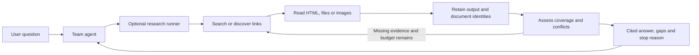

# Multi-source research: integration and demo

The optional `ask` / `research()` runner can search, read several URLs, inspect
retained text, compare evidence and return a cited answer. The team's main agent
decides **when external information is needed** and passes a focused question to
this runner. It then combines the returned evidence with the analytical tools.



## Run it yourself

Use the existing checkout. For fresh-clone prerequisites, Docker/WSL setup and
the private MIA key, follow [README.md](README.md) and [DEMO.md](DEMO.md) first.
Do not paste Markdown links into URL arguments; use plain `https://...` strings.

```bash
cd ~/Agentic_Analysis_Coderspace
export WEB_TOOLS_ENABLED=true WEB_AGENT_ENABLED=true
export WEB_DOCUMENTS_ENABLED=true WEB_LINKS_ENABLED=true
export WEB_OCR_ENABLED=false WEB_VISION_ENABLED=false
./extensions/web_tools/web-tools start
./extensions/web_tools/web-tools check

umask 077
export WEB_RESULTS_DIR="$(mktemp -d "${TMPDIR:-/tmp}/web-research.XXXXXX")"

# Read two different text documents, then compare their scope.
./extensions/web_tools/web-tools ask \
  'RFC 9110 ve RFC 9111 belgelerinin kapsamını Türkçe karşılaştır. Hangisi HTTP anlamlarını, hangisi önbelleklemeyi tanımlar? Kaynak göster.' \
  --url 'https://www.rfc-editor.org/rfc/rfc9110.txt' \
  --url 'https://www.rfc-editor.org/rfc/rfc9111.txt' \
  --require 'RFC 9110 belgesinin konusu nedir?' \
  --require 'RFC 9111 belgesinin konusu nedir?' \
  --min-sources 2 --max-tool-calls 4 \
  > "$WEB_RESULTS_DIR/comparison.json"

python3 - <<'PY'
import json, os
from pathlib import Path
r = json.loads((Path(os.environ['WEB_RESULTS_DIR']) / 'comparison.json').read_text())
print('Status:', r['status'], 'Stop:', r['stop_reason'], 'Error:', r['error'])
print(r['answer'])
for s in r['sources']:
    if s['id'] in r['citations']:
        print(f"[{s['id']}] {s['document_id']} {s['url']} — {s['location']}")
print('Coverage:', r['coverage'])
print('Conflicts:', r['conflicts'])
print('Missing:', r['missing_information'])
print('Usage:', r['usage'])
print('Saved:', Path(os.environ['WEB_RESULTS_DIR']) / 'comparison.json')
PY
```

Expected: two distinct documents, citations to their read excerpts, and coverage
for both requirements. `partial` is normal when reading only a bounded portion
of these long files. Check `error`, coverage and missing information separately.
This example uses MIA planning/synthesis quota; extraction itself needs no OCR or
vision. The model may request additional bounded reads, so exact call counts vary.

To let the model find its own sources, omit `--url`:

```bash
./extensions/web_tools/web-tools ask \
  'BDDK Türk Bankacılık Sektörü Temel Göstergeleri ile aylık bankacılık sektörü verilerinin kapsamını resmi kaynaklardan araştır ve karşılaştır. Sayısal hesaplama yapma.' \
  --require 'Temel Göstergeler raporunun kapsamı ve yayın sıklığı' \
  --require 'Aylık bankacılık sektörü verilerinin kapsamı ve yayın sıklığı' \
  --min-sources 2 > "$WEB_RESULTS_DIR/bddk-research.json"
```

The model can issue focused searches, read several results, discover a report's
attachments, and read PDF/Excel/text/image URLs. Enabling images/OCR/vision and
their limits works as before. Vision additionally requires `--allow-vision` for
each question. Files are processed sequentially; this is not a recursive crawler.

## Python integration

```python
from backend.extensions.web_tools.research import research

result = research(
    "Compare the scope of HTTP semantics and HTTP caching.",
    urls=["https://www.rfc-editor.org/rfc/rfc9110.txt",
          "https://www.rfc-editor.org/rfc/rfc9111.txt"],
    requirements=["Scope of RFC 9110", "Scope of RFC 9111"],
    min_sources=2,
    max_tool_calls=4,
    environ={"WEB_TOOLS_ENABLED": "true", "WEB_AGENT_ENABLED": "true",
             "WEB_DOCUMENTS_ENABLED": "true"},
)
```

The worker must already be running with matching capabilities and the private
MIA key. Python reads the supplied/process environment, not the extension `.env`.
The legacy `url="..."` keyword still works; `urls=[...]` adds multiple seeds.
Repeated CLI `--url` arguments are equivalent to `urls`. There is no mandatory
two-source policy: `min_sources` defaults to **1**. For a comparison, supply its
required subjects explicitly. If `requirements` is omitted, the whole question
becomes `R1`; the model can still perform multiple searches and reads.

The main agent should display the answer **with** citations, gaps, conflicts and
warnings. On `partial`, use only the covered scope or ask a focused follow-up.
On an error, do not present an empty/incomplete answer as successful research.
Each call starts a new run; the team app owns conversational memory and aggregate
user quotas. Worker-side hourly model limits apply across runs.

## Output contract for applications and AI agents

| Field                            | Meaning                                                                                                                             |
| -------------------------------- | ----------------------------------------------------------------------------------------------------------------------------------- |
| `answer`, `citations`        | Answer with`[S1]` references and the exact cited ID list                                                                          |
| `sources`                      | All retained citation excerpts, including uncited ones; URL, timestamp, location, method, document ID and extraction-record index   |
| `documents`                    | `D1`, `D2` identities, aliases, fingerprints, extraction-record indices; `duplicate_of` when later evidence merges identities |
| `evidence`                     | Full accepted tool-output records with arguments; index matches`sources[].record_index`                                           |
| `coverage`                     | Each requirement:`supported`, `missing`, `conflicting` or `not_assessed`, with evidence references and note                 |
| `conflicts`                    | Model-reported inconsistencies, descriptions and evidence references                                                                |
| `missing_information`          | Uncovered requirements and unmet distinct-document minimum                                                                          |
| `stop_reason`                  | Sufficiency, incomplete evidence, a budget/duplicate stop, or a failure code                                                        |
| `trace`, `usage`, `limits` | Actions/status, charged calls/bytes/time, and effective limits                                                                      |

`sources` now preserves uncited evidence as well. Render answer references by
filtering it with `citations`. `S1` identifies a section/window; `D1` identifies a
document. Pages of one PDF never count as separate documents. Redirect aliases
and exact file-byte/full extracted HTML fingerprints are grouped. A complete
extraction hash is a fallback; shared **truncated** introductions are not merged.
Do not treat unique documents, hosts or domains as proof of independent sources:
syndicated stories, reformatted copies and related publishers can still overlap.

The model sees a bounded context snapshot. Shortening it does not change the
retained `evidence` records. The runner-only `inspect_evidence(source_id, offset, max_chars)` action retrieves another range from a retained section and gives it
a new citation ID, without a network/model interpretation call. It still consumes
one tool call and may require another planning call. The ordinary `get_tools()`
mapping and `schemas` CLI do not advertise this session-local action.

Saving the returned JSON preserves the complete **tool output within its read
limits**, not original binary files or unread pages. Native downloads are temporary
and deleted after extraction. Another PDF page range may need another download;
the existing optional cache reuses identical extraction requests. To inspect an
accepted extraction locally without calling the model or network:

```python
content = result['evidence'][0]['output'].get('content', '')
```

Citation checking rejects unread IDs and validates coverage/conflict references.
Coverage and conflict detection remain **model assessments**: the application
does not verify entailment, independently establish dates/units, or discover all
possible contradictions. No automatic arithmetic, table normalization or
lakehouse ingestion is added; use the explicit validation contract first.

## Limits and stop behavior

Set these in the private `.env` or process environment, then restart the worker.
Runner settings are intersected with the worker's advertised settings; a caller
cannot raise the service limits through `ask` arguments.

| Setting                          |   Default | Scope                                                                                      |
| -------------------------------- | --------: | ------------------------------------------------------------------------------------------ |
| `WEB_AGENT_ENABLED`            | `false` | Disable the optional model runner/endpoint                                                 |
| `WEB_AGENT_MAX_TOOL_CALLS`     |         6 | All tool actions, including local evidence inspection                                      |
| `WEB_AGENT_MAX_MODEL_CALLS`    |         6 | Planning plus reserved file OCR/vision calls                                               |
| `WEB_AGENT_MAX_SOURCES`        |         6 | Distinct URL read attempts, including failures; known aliases/page ranges reuse an attempt |
| `WEB_AGENT_MAX_DOWNLOAD_BYTES` |  20971520 | Per-question file payload allocation (20 MiB)                                              |
| `WEB_AGENT_MAX_EVIDENCE_BYTES` |   8388608 | Retained tool-record JSON encoded as UTF-8 (8 MiB)                                         |
| `WEB_AGENT_TIMEOUT_SECONDS`    |       300 | Client run deadline                                                                        |
| `WEB_AGENT_MAX_CONTEXT_CHARS`  |     20000 | Serialized model context characters                                                        |

Existing per-file bytes/pages/rows/characters, per-read model calls and hourly
model limits still apply. `--max-tool-calls` can lower the run's tool cap.

Before a file-capable read, the runner reserves at most one file's allowed bytes,
passes the remaining allowance to the worker, and refunds unused allocation on
a measured success. Cache hits/HTML results refund that file allocation. A failed
or lost response keeps its reservation because actual work may be unknown.
`download_bytes_charged` is therefore conservative allocation, not a network meter.
It excludes browser/search traffic, TLS/header overhead and the downloader's
single overflow-detection byte. Exhaustion stops further URL reads, including
unknown URLs that might turn out to be HTML. Discovery has its own tool/time caps.

The deadline bounds client HTTP waits and stops new actions. An in-flight worker
may finish later under its existing service timeout; arbitrary custom synchronous
Python hooks cannot be forcibly cancelled by this runner. No background retry
loop is created. Context-local deadlines do not affect ordinary independent tools.

On a source/download/output limit, the model gets a final opportunity to answer
from retained evidence if time/model budget remains. Oversized new output is not
retained; earlier outputs remain intact and `stop_reason` reports `evidence_limit`.
If synthesis fails or time expires, the result still contains accepted evidence
and unassessed requirements. No fallback answer is fabricated.

See [MULTISOURCE_PLAN.md](MULTISOURCE_PLAN.md) for scope and acceptance criteria,
and [VERIFICATION.md](VERIFICATION.md) for checks actually executed.
