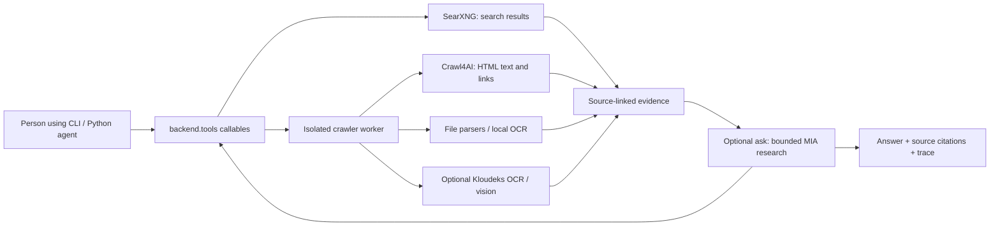

# Optional web tools: search, URL reading, OCR, vision, and cited research

This extension adds `search_web` (your own SearXNG instance) and `read_url`
(local Crawl4AI with Chromium). `WEB_TOOLS_ENABLED=false` is the default.
The existing ingestion commands, lakehouse build, dependencies, data, and tests keep
their original behavior. No web service or browser is required for the baseline.

For optional PDF, XLSX/XLS, CSV, DOCX, TXT/Markdown/JSON, image discovery, local OCR, and Kloudeks MIA
vision/OCR, follow the [step-by-step file and image guide](ASSETS.md). Those features
have independent switches, limits, and an additional isolated Docker image target.

## Start here

| Your goal | Read |
| --- | --- |
| Set up the extension and use it from an existing app | [Developer quick start](DEVELOPER_GUIDE.md) — baseline isolation, setup, Python integration and troubleshooting |
| Instruct an AI bot or implement its tool dispatch | [AI integration guide](AI_USAGE.md) — routing policy, validated calls and evidence contracts |
| Run the full search → read → cited answer demonstration | [Demo guide](DEMO.md) — self-contained commands and output files |
| Research and compare several sources | [Multi-source guide](MULTISOURCE.md) — coverage, conflicts, retained evidence and question-level limits |
| Connect the team's existing agent and compare branches | [Team integration](TEAM_INTEGRATION.md) — adapter and table-validation contract |
| Test the tools yourself, from Docker to saved results | [Testing walkthrough](TESTING.md) — commands, expected output, cache/limit checks, and shutdown |
| Understand which tool to call and connect an AI agent | [AI and developer reference](AI_USAGE.md) — signatures, result contracts, evidence handling, and Python example |
| Configure file/image formats, OCR, MIA, and all resource limits | [File/image configuration guide](ASSETS.md) |
| Set up another developer's machine from a fresh clone | [Onboarding below](#recommended-wsl2-setup) |
| See what has actually been tested | [Verification record](VERIFICATION.md) |
| Review licenses and dependency pins | [Third-party notes](THIRD_PARTY.md) |

All shell commands in these guides run from the repository root in **Ubuntu/WSL
Bash**, unless labeled PowerShell. Reuse an existing checkout and its feature
branch; do not clone again just to run the tools. Changing configuration requires
`web-tools start` to apply it to Docker. The CLI reads its private `.env`; Python
callers use an explicit configuration mapping or process environment.

## What each tool does

| CLI command | Python callable | Output / use | Extra switch |
| --- | --- | --- | --- |
| `search` | `search_web` | Ranked URLs, titles, snippets, and search engine availability | Master switch only |
| `read` | `read_url` | HTML page text as Markdown, title, source URL, and fetch time | Master switch only |
| `url` | `read_web_url` | Automatically route HTML, documents, text and images | Master switch; detected file type also needs its capability enabled |
| `assets` | `get_page_assets` | File links and image URLs on a page; linked assets are not downloaded | `WEB_LINKS_ENABLED=true` |
| `document` | `read_document` | PDF text/tables, XLSX/XLS/CSV rows, DOCX, TXT/Markdown/JSON text | `WEB_DOCUMENTS_ENABLED=true` |
| `image` | `read_image` | Image metadata; text with OCR; interpretation with vision | `WEB_IMAGES_ENABLED=true` |
| `ask` | `research(question, ...)` | Bounded tool selection, answer, citations, trace and usage | `WEB_AGENT_ENABLED=true`, worker MIA key |
| `schemas` | `tool_schemas(config, ...)` | Framework-neutral function schemas | Master switch |

Every callable also requires `WEB_TOOLS_ENABLED=true`. OCR is separately allowed
by `WEB_OCR_ENABLED`; vision requires `WEB_VISION_ENABLED` **and** `--vision` on
the call. Local Tesseract OCR needs no API key. Optional MIA OCR and vision use
Kloudeks credentials, the supplied model IDs, and bounded model-call budgets.
Image metadata, OCR text, and a model's chart interpretation are different outputs.

Typical use: find an official source, read its page, discover its attachments,
extract a few relevant pages, then use OCR or vision only if the needed evidence
is in pixels. Keep source URLs and page/sheet locations with the answer. See
[AI_USAGE.md](AI_USAGE.md) for result handling and integration details.

## Where this connects

The optional `ask` command now selects web tools and produces an answer with source
IDs, URLs and page/section locations. It is a bounded, single-question web research
runner, not the team's full multi-turn analytical application. It uses ordinary
MIA chat with strictly validated JSON decisions; it does not require a vendor SDK.
It refuses unknown tools and citations to sources that were never read.

`backend.tools.get_tools()` is a small new integration seam: a mapping of tool
names to synchronous Python callables. It returns an empty mapping while disabled,
before importing extension code. Future orchestration can register these callables
alongside its own tools. The optional runner adds no agent-framework dependency. Image/OCR
interpretation uses one new Kloudeks client abstraction under `backend/model_clients/`;
the existing analytical spreadsheet parsers remain unchanged.

The implementation lives in `backend/extensions/web_tools/`, so the existing
`backend*` package discovery includes it without changing `pyproject.toml`.
Deployment, tests, configuration, and these instructions live here.



Website access and model requests from the worker pass through the validating
egress proxy. The diagram shows the logical workflow; the [isolation section](#configuration-and-isolation)
describes Docker networking. The tools do not insert these results into DuckDB
or a vector index automatically.

## Recommended WSL2 setup

Use Ubuntu 24.04 x86-64 in WSL2, Python 3.12 supplied by Ubuntu, and Docker Engine with
the Compose plugin inside WSL. The service images carry their own pinned runtime,
Python packages, and Chromium. You do not install Crawl4AI, Playwright, or browser
libraries into the baseline virtual environment. No global Python packages are needed.

If this checkout is already open in WSL, keep using it; skip cloning below.
The web tools and their file/image extensions are maintained on `perhat` in the
original checkout. Temporary implementation branches are not needed to use them.
No separate worktree was needed.

### Windows PowerShell: WSL and VS Code

Check the installed distributions:

```powershell
wsl --version
wsl --list --verbose
```

For a new machine without Ubuntu:

```powershell
wsl --install -d Ubuntu-24.04
```

Install VS Code on Windows and its Microsoft **WSL** extension. Open an Ubuntu
terminal for all following Bash commands. Keep the checkout in Linux storage
such as `~/src`, rather than `/mnt/c`.

### WSL Bash: fresh clone and baseline

These commands are for another developer who does not already have a checkout.
Use the team's `perhat` branch after the changes have been pushed there.

```bash
mkdir -p ~/src
cd ~/src
git clone --branch perhat https://github.com/Erayisci/Agentic_Analysis_Coderspace.git
cd Agentic_Analysis_Coderspace
code .
```

Use existing GitHub authentication for this private repository. Do not put a token
in the clone URL. In VS Code, verify that the status bar says WSL/Ubuntu.

If you also need the baseline environment, follow the root README. On a new Ubuntu
installation, install the missing host prerequisites with:

```bash
sudo apt update
sudo apt install git python3 python3-venv
```

Then, from the repository root:

```bash
python3 -m venv .venv
.venv/bin/python -m pip install -e '.[dev]'
.venv/bin/python -m backend.ingestion.bddk_bulletin --from-cache
.venv/bin/python -m backend.lakehouse.build
.venv/bin/python -m pytest -q
```

For an existing working baseline, keep its environment and startup commands.
The extension commands below can use system `python3` without installing the
baseline dependencies. There is no baseline HTTP server to start at this stage.

### WSL Bash: Docker prerequisite

First check for an existing installation:

```bash
docker version
docker compose version
```

Both client and daemon must work. Use the `docker compose` plugin with support
for `up --wait` (Compose v2 or newer).
If Docker Desktop is already your team's setup, use the integration instructions
below instead of installing a second Docker engine.

For Ubuntu 24.04 without Docker, add Docker's official package repository and
install Engine and Compose. These commands install OS prerequisites; the project
bootstrap does not run privileged commands or modify system configuration.

```bash
sudo apt update
sudo apt install ca-certificates curl
sudo install -m 0755 -d /etc/apt/keyrings
sudo curl -fsSL https://download.docker.com/linux/ubuntu/gpg -o /etc/apt/keyrings/docker.asc
sudo chmod a+r /etc/apt/keyrings/docker.asc
sudo tee /etc/apt/sources.list.d/docker.sources >/dev/null <<EOF
Types: deb
URIs: https://download.docker.com/linux/ubuntu
Suites: noble
Components: stable
Architectures: $(dpkg --print-architecture)
Signed-By: /etc/apt/keyrings/docker.asc
EOF
sudo apt update
sudo apt install docker-ce docker-ce-cli containerd.io docker-buildx-plugin docker-compose-plugin
sudo systemctl enable --now docker
sudo usermod -aG docker "$USER"
```

Sign out of the WSL session and reopen it for group membership to take effect,
or run `newgrp docker` for the current terminal. Membership in the Docker group
grants root-equivalent access. Run `docker version` and `docker compose version`
again without `sudo`. These steps follow [Docker's Ubuntu installation guide](https://docs.docker.com/engine/install/ubuntu/)
and [post-installation guide](https://docs.docker.com/engine/install/linux-postinstall/).

If systemd is unavailable, inspect `/etc/wsl.conf`. Preserve its existing entries
and add `systemd=true` under `[boot]` if needed. Close your work before restarting
that distro from PowerShell with `wsl --terminate Ubuntu-24.04`, then reopen Ubuntu.
See [Microsoft's WSL systemd instructions](https://learn.microsoft.com/en-us/windows/wsl/systemd).

**Existing Docker Desktop:** start Desktop on Windows, select **Use WSL 2 based
engine** in Settings → General, then enable your Ubuntu distribution in Settings
→ Resources → WSL Integration and apply. Use Linux containers. Reopen the WSL
terminal and retry the two Docker checks. Do not run Desktop and a separately
installed WSL Docker Engine together. See [Docker's WSL integration guide](https://docs.docker.com/desktop/features/wsl/).
The recommended Docker Engine path above uses open-source software; Desktop is
an alternative with its own license terms.

## Daily commands

Run all commands from the repository root in **WSL Bash**:

```bash
./extensions/web_tools/web-tools setup
./extensions/web_tools/web-tools test
./extensions/web_tools/web-tools start
./extensions/web_tools/web-tools browser-test
WEB_TOOLS_ENABLED=true ./extensions/web_tools/web-tools check
WEB_TOOLS_ENABLED=true ./extensions/web_tools/web-tools smoke
```

`setup` creates a Git-ignored local configuration only when missing and preserves
existing values on subsequent runs. The `.env.example` contains local defaults.
`start` builds the isolated image and starts only this extension's Compose
project. The first build downloads Python dependencies and Chromium; allow time
and disk space for that. Later builds reuse Docker's cache.

The one-command environment setting above enables the tools for that invocation.
For persistent extension-command use, change `WEB_TOOLS_ENABLED` to `true` in
`extensions/web_tools/.env`. The command wrapper loads this file without replacing
values already exported in your process. The baseline does not automatically
source this file. Never copy secrets into the root environment or shell startup.

Try a query and pass a returned HTML URL to the reader:

```bash
WEB_TOOLS_ENABLED=true ./extensions/web_tools/web-tools search 'SearXNG documentation'
WEB_TOOLS_ENABLED=true ./extensions/web_tools/web-tools read 'https://docs.searxng.org/'
./extensions/web_tools/web-tools logs
```

The live smoke command searches through your configured SearXNG, chooses a returned
public URL, and reads it through Crawl4AI. It reports complete, partial, empty, or
failed results and preserves the source URL. It needs internet and running services
but no model credentials. Deterministic `test` does not access external sites.
`browser-test` runs additional HTML, JavaScript, redirect, private-subrequest, and TLS
fixtures inside the running crawler container using its real SDK and Chromium;
the fixture pages do not contact external websites. Ordinary `test` skips these
five browser cases. `config` prints effective extension settings with the secret
redacted. `check` checks service readiness without sending a public search query;
`smoke` also verifies that JSON search works with actual upstream engines.

To stop only these services while preserving their data:

```bash
./extensions/web_tools/web-tools stop
```

Set `WEB_TOOLS_ENABLED=false` in the extension `.env` and unset any exported
`WEB_TOOLS_ENABLED` value, or explicitly export it as `false`, to remove the
tools from registration. Process variables override the extension file. Existing
baseline commands need no changes.

## Configuration and isolation

The example and command help are the authoritative list of settings. Defaults:

| Setting | Purpose |
| --- | --- |
| `WEB_TOOLS_ENABLED=false` | Opt-in registration; disabled mode needs no services |
| `WEB_SEARCH_PORT=8888` | WSL localhost port for SearXNG |
| `WEB_CRAWLER_PORT=8932` | WSL localhost port for the crawler worker |
| `WEB_SEARXNG_URL` | Empty in the example; CLI derives `http://127.0.0.1:8888` from the search port |
| `WEB_CRAWLER_URL` | Empty in the example; CLI derives `http://127.0.0.1:8932` from the crawler port |
| `WEB_SEARCH_TIMEOUT_SECONDS=15` | Search attempt timeout |
| `WEB_CRAWL_TIMEOUT_SECONDS=45` | Crawl timeout |
| `WEB_MAX_RESULTS=10` | Maximum search results returned |
| `WEB_MAX_CONTENT_CHARS=20000` | Maximum returned Markdown characters |
| `WEB_MAX_CONCURRENCY=2` | Maximum simultaneous tool/crawl work |
| `WEB_RETRIES=1` | Bounded retries for transient service failures |

Search timeout accepts 1–120 seconds; crawl timeout accepts 1–180 seconds. The
HTTP client allows five additional seconds for the crawler's deadline response.
Results are capped at 1–50, content at 100–100,000 characters, concurrency at 1–8,
and retries at 0–3. Excess requested result/content counts clamp to configured
limits. The client retries transient HTTP errors/timeouts at most `WEB_RETRIES`
times with short bounded backoff; it does not automatically retry a failed crawl
returned as a structured result. A semaphore rejects excess concurrent calls.
The worker kills the crawl's process group when its deadline expires, including
DNS, rendering and extraction. A page can issue at most 128 requests; HTML is
limited to 4 MiB and each proxy tunnel to 32 MiB/60 seconds. Compose adds memory
and process limits. The browser may load dynamically delayed content incompletely;
the default waits one second after DOM readiness rather than interacting with a page.

Both published services bind to `127.0.0.1`. The crawler uses only an internal
Docker network. Its host port is published by the egress container, whose bounded
TCP gateway forwards requests exclusively to `crawler:8932`. This makes the worker
reachable from WSL without giving the browser a direct Internet route. The gateway
allows at most 16 connections, 3 MiB per connection, and a 190-second lifetime
(up to 310 seconds when a longer optional asset deadline is configured).
The separate, unpublished proxy port `3128` handles website access and checks all DNS
answers, connects to validated public IP addresses, and permits HTTP/HTTPS on
ports 80/443. Redirects and browser subrequests also pass through this boundary.
The trusted internal SearXNG origin is intentionally separate from user URL rules.
No baseline data directories or Docker sockets are mounted into the crawler.
The optional asset image receives only its own cache volume and configured MIA key;
the standard HTML image needs neither. Do not expose these development services to a shared network.

Each setup receives its own Compose project identity. For another checkout or
worktree, run setup there rather than copying its real `.env`. Choose different
host ports when running both at once. Leave URL overrides blank to derive them
automatically, or update explicit URL overrides to match.
Inside containers, `localhost` means that container: use service names
`searxng:8080`, `crawler:8932`, and `egress:3128` on the appropriate Compose
network. A future containerized baseline would need an explicit connection to the
extension network and service-name URLs; the current baseline runs in WSL.

Setup/start/stop do not kill processes using ports, delete volumes, or run Docker
cleanup. Runtime state and secrets stay in ignored local configuration or
extension-specific Docker resources. Changing dependency pins requires a rebuild
and renewed smoke/security testing; see the lockfile and [third-party notes](THIRD_PARTY.md).

## Calling the tools from Python

This works from the repository root or the existing editable baseline install:

```python
from backend.tools import get_tools

tools = get_tools({
    "WEB_TOOLS_ENABLED": "true",
    "WEB_SEARXNG_URL": "http://127.0.0.1:8888",
    "WEB_CRAWLER_URL": "http://127.0.0.1:8932",
})
search = tools["search_web"]("SearXNG documentation", max_results=3)
if search["results"]:
    page = tools["read_url"](search["results"][0]["url"])
    print(page)
```

Calling `get_tools()` without an explicit mapping reads process environment.
It does not load any `.env` or modify model settings. Reuse one mapping so its
concurrency limit is shared. A future Kloudeks/LangGraph integration can reuse
`backend.model_clients.kloudeks.KloudeksClient`. Search and HTML reading do not
call a model; optional MIA OCR/vision does, only when enabled and requested.

Search accepts `query`, bounded `max_results`, optional `language`, `time_range`
(`day`, `month`, `year`), and `domains`. Domains are also checked against returned
URLs; language/time filtering depends on upstream engine support. Each result
preserves `title`, `url`, `snippet`, and engine metadata. A publication date appears
only when supplied by the source. Empty results and unavailable engines remain
visible. See the [SearXNG Search API](https://docs.searxng.org/dev/search_api.html).

The reader returns requested/final URLs, title, Markdown content, content type,
fetch time, status, and explicit character counts/truncation metadata. Extraction
uses Crawl4AI's deterministic Markdown path with Chromium rendering, including
ordinary JavaScript pages; there is no LLM extraction or paid fallback. See
[Crawl4AI configuration](https://docs.crawl4ai.com/core/browser-crawler-config/).
The HTML reader rejects PDF, Excel, images, and other non-HTML downloads. Enable
the separate `read_document` and `read_image` tools to process supported files;
see [ASSETS.md](ASSETS.md).
Existing analytical parsers continue to work independently. There is no login,
CAPTCHA bypass, authenticated browsing, or custom JavaScript execution interface.
The SDK can reject very short pages as possible access challenges; those return
a crawl error rather than fabricated content. The browser uses fresh contexts,
blocks service workers and WebSockets, checks certificate validity, and has no
direct route to the internet in Compose. The supported security boundary includes
the internal network and validating proxy; running this worker with unrestricted
networking is not the supported deployment.

Some websites omit intermediate HTTPS certificates. When the preliminary Python
connection cannot build an issuer chain, the reader lets Chromium attempt its own
certificate verification. Chromium must still verify the chain and hostname before
reading content; normal redirect, HTTP status, MIME and size checks remain in place.
Expired certificates, hostname mismatches, and other preliminary certificate errors
stop immediately. Certificates Chromium cannot verify return `certificate_error`.

Tool responses are **external, untrusted data**. Consumers must keep page text
out of system/developer instructions, ignore embedded requests to change tools or
reveal credentials, check status/truncation before reasoning, and cite the preserved
source URLs. Neither a search hit nor successfully extracted text establishes
that a claim is true. An unavailable web service produces a tool error rather
than changing unrelated pipeline behavior.

## Troubleshooting

| Symptom | Action |
| --- | --- |
| `docker: command not found` | Install Engine as above, or enable Desktop's integration for this WSL distro. **macOS with Docker Desktop installed** (`Docker.app` in `/Applications` but no `docker` on `PATH`): Desktop's first-run setup normally symlinks its CLI into `/usr/local/bin` itself; if that step was skipped, run `sudo ln -s /Applications/Docker.app/Contents/Resources/bin/docker /usr/local/bin/docker` once (your own Mac admin password, not shared) and reopen the terminal. |
| Docker Desktop install fails with a Rosetta/`VZErrorDomain` virtualization error (Apple Silicon) | Choose "Continue without Rosetta" -- this project's containers (SearXNG, the crawler) are multi-arch images that run native ARM64, so Rosetta (x86 emulation) is not needed here. |
| Cannot connect to Docker daemon | Start Docker (`sudo systemctl start docker` for Engine); check group membership, or start Desktop. |
| Crawler is healthy / `browser-test` passes, but `check` says unavailable | Rerun `start` to rebuild and apply the current port gateway. Docker does not publish ports from an internal-only container; the host crawler port belongs to `egress`, forwarding to the isolated worker. Check effective ports with `config` and retry `check`. |
| Address already in use | Inspect `ss -ltn`; choose unused extension ports in `.env`, update the host URLs, and rerun `start`. Keep other processes running. |
| SearXNG JSON returns 403 | Confirm this project's settings are mounted and `search.formats` includes `json`; recreate with `start` after correcting configuration. |
| Empty/partial search, 429, CAPTCHA | Inspect unavailable-engine metadata and logs. Wait, reduce concurrency/retries or change the enabled free engines in settings. There is no paid fallback or unlimited-throughput guarantee. |
| Chromium missing or shared-library failure | Rerun `start` and inspect image build errors. Browser packages and Linux libraries install inside the crawler image, never via host `playwright install` or `sudo pip`. |
| Page fails or is unsupported | Check its HTTP status/type; use `read` for HTML, or enable `document`/`image` for supported files. Private addresses, nonstandard ports, and login-only sites are rejected. |
| `certificate_error` | The site's HTTPS certificate could not be verified. Missing issuer chains are retried through Chromium's normal verifier; if verification still fails, use another source or wait for the site operator to fix its HTTPS configuration. |
| Configuration ignored by Python | `get_tools()` reads process environment only; pass an explicit mapping or set the feature/service variables in your launcher. The CLI loads only its own `.env`. |
| Missing model credentials | Search, HTML, document text, and local OCR need none. For optional MIA vision/OCR, set the key locally and restart as described in [ASSETS.md](ASSETS.md). |

Search and crawling have no required search subscription. Hosting, network access,
electricity, and any existing/future model API usage are separate costs. Upstream
engines can change layouts, impose rate limits, or decline automated requests.

## Verification

See [VERIFICATION.md](VERIFICATION.md) for the actual environment, before/after
regression results, deterministic test coverage, and live Docker checks. A mocked
test pass is not a claim that an external engine or browser worked live.
